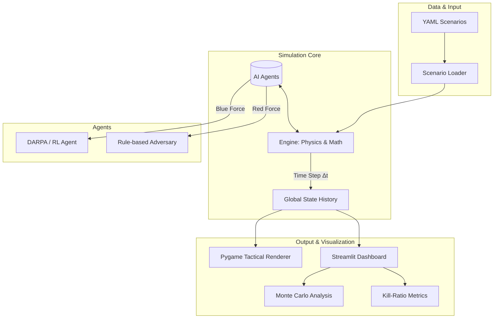

<div align="center">
  <h1>🚀 Aerial Multi-Agent Simulation Engine</h1>
  <p><b>A High-Fidelity Beyond Visual Range (BVR) Combat & Tactical AI Evaluation Environment</b></p>
  
  [](https://www.python.org/)
  [](LICENSE)
  [](https://streamlit.io/)
  [](https://www.pygame.org/)
  []()
</div>

---

## 📖 Table of Contents
- [1. The Problem Statement](#1-the-problem-statement)
- [2. Project Overview](#2-project-overview)
- [3. Core Features & Capabilities](#3-core-features--capabilities)
- [4. System Architecture & Workflow](#4-system-architecture--workflow)
- [5. Mathematical & Physics Models](#5-mathematical--physics-models)
- [6. Data Structures & Entities](#6-data-structures--entities)
- [7. Installation & Usage](#7-installation--usage)
- [8. The Dashboard](#8-the-dashboard)
- [9. Deep Reinforcement Learning (PPO)](#9-deep-reinforcement-learning-ppo)

---

## 🛑 1. The Problem Statement

**Real-world aerospace testing is prohibitively expensive and inherently dangerous.**
Testing new aircraft formations, experimental AI pilot algorithms, or advanced sensor configurations (like upgraded Radars or ECM) requires millions of dollars in flight hours. Militaries and defense contractors (e.g., DARPA, Lockheed Martin) desperately need a **computational proving ground** to rapidly test "What if?" tactical scenarios through massive statistical analysis before ever flying a physical jet.

This project solves that problem. It is **not a game**; it is a **mathematical research engine** built to simulate combat physics, assess AI decision-making (Utility Functions), and output empirical survival probabilities through Monte Carlo analysis.

---

## 🌍 2. Project Overview

The **Aerial Multi-Agent Simulation Engine** is a comprehensive Python framework designed for the modeling, simulation, and analysis of 3D Beyond Visual Range (BVR) engagements. It allows researchers to:
1. Pit multiple autonomous agents against each other in highly configurable XML/YAML scenarios.
2. Evaluate AI logic (rule-based DARPA agents vs. Reinforcement Learning PPO agents).
3. Visualize the mathematical outcomes using a high-framerate Pygame renderer or a robust Streamlit Data Analytics Dashboard.

---

## ✨ 3. Core Features & Capabilities

* **High-Fidelity 3D Physics:** Entities operate in a strict 3D space (`x`, `y`, `z`). Kinematics account for altitude density, dive advantages, and climb penalties.
* **Aspect-Dependent Radar Cross Section (RCS):** Radar detection isn't a simple "distance check." It relies on the **Radar Range Equation** evaluating Signal-to-Noise Ratio (SNR). Catching a jet from the side (broadside) yields a 200% larger signature than head-on.
* **Autonomous AI Pilots:** The agents utilize a 5-step Observe-Orient-Decide-Act (OODA) loop. They calculate the Probability of Kill ($P_k$) geometrically before deciding to fire, intercept, or notch defensives.
* **Dual Rendering Engines:**
  * **Pygame Visualizer:** A live 60fps tactical display for observing real-time algorithmic combat, complete with HUD, RWR warnings, and an interactive Scenario Menu.
  * **Streamlit Dashboard:** A web-app designed for post-action analysis, featuring Playback Animations, Monte Carlo bulk-run analysis, and tactical comparisons.
* **Electronic Warfare (ECM):** Implementation of jammers and chaff deployment that statistically disrupts missile tracking variables depending on distance and burn-through rates.

---

## ⚙️ 4. System Architecture & Workflow

The architecture strictly separates the **Simulation Engine**, the **AI Logic**, and the **Visualization layers**.



### The Simulation Loop Workflow
1. **Initialize:** Parse `aggressive_showdown.yaml` instantiating `Aircraft` and `Missile` arrays.
2. **Perceive Phase:** Aircraft evaluate Line Of Sight (LOS), Distance, and run Radar sweeps against environmental noise.
3. **Assess Phase:** `threat_assessment.py` builds a threat matrix ranking enemies by lethality.
4. **Decide Phase:** `blue_agent.py` runs Utility Functions to choose an action (Engage, Defend, Rejoin, Support).
5. **Act Phase:** Commands (Change Heading, Change Altitude, Fire Missile) are passed to the kinematics engine.
6. **Log:** State is deeply serialized into `SimulationResult` memory.

---

## 🧮 5. Mathematical & Physics Models

### Radar Range Equation (Signal-to-Noise Ratio)
Detection is governed by physical constants. The standard equation utilized is:
$$ SNR = \frac{P_t \cdot G^2 \cdot \lambda^2 \cdot \sigma}{(4\pi)^3 \cdot R^4 \cdot k \cdot T \cdot B \cdot L} $$
Where $\sigma$ (Sigma) changes dynamically based on the target's relative heading (Aspect Angle).

### Kill Probability ($P_k$)
The decision to fire a missile uses a kinematic likelihood estimator based on $F$-pole distance and track quality:
$$ P_k(estimated) = (Kinematic Factor \cdot 0.6) + (TrackQuality \cdot 0.4) $$
If $P_k < 0.40$, the AI will conserve ammunition and maneuver for a better firing solution.

---

## 📦 6. Data Structures & Entities

### `Aircraft` Object
A robust dataclass handling internal flight dynamics and avionics.
* `x_km`, `y_km`, `z_km`: 3D Cartesian coordinates.
* `velocity_ms`: Scalar speed.
* `heading_deg`, `pitch_deg`: Euler rotational angles.
* `radar`: Instance of `Radar` managing `detect()` and `track()`.
* `missiles_remaining`: Integer tracking payload.

### `Missile` Object
* `owner_id`, `target_id`: GUID strings linking agents.
* `phase`: State Machine `['BOOST', 'MIDCOURSE', 'TERMINAL']`.
* Utilizes **Proportional Navigation (PN)** guidance logic to intercept maneuvering targets.

---

## 💻 7. Installation & Usage

### Setup Environment
```bash
git clone https://github.com/imshivanshutiwari/aerial-multiagent-sim.git
cd aerial-multiagent-sim
python -m venv .venv
source .venv/bin/activate  # On Windows: .venv\Scripts\activate
pip install -r requirements.txt
```

### 🎮 Run the Interactive Pygame Visualizer
View the mathematical AI in real-time through the live engine. Includes an interactive main menu to select scenarios!
```bash
python main.py --pygame
```

### 🔬 Run Headless & Generate Reports
Runs without a GUI and prints statistical outputs to the terminal (useful for CI/CD bulk testing).
```bash
python main.py --scenario data/scenario_configs/aggressive_showdown.yaml
```

---

## 📊 8. The Dashboard

The Streamlit Dashboard is the analytical heart of the project.
```bash
streamlit run dashboard/app.py
```

**Tabs Include:**
1. **🎯 Live Tactical Display:** Watch flicker-free Plotly animations of the battles you just simulated.
2. **📊 Engagement Analysis:** View continuous telemetry.
3. **🎲 Monte Carlo Results:** Run 50+ matches automatically to generate Box Plots showing structural probabilities of winning rather than isolated incidents.
4. **📈 Research Findings:** Documented proof displaying the evolution of the model (Baseline vs. High-Fidelity Physics).

---

## 🧠 9. Deep Reinforcement Learning (PPO)

This simulator includes a Gymnasium Environment (`simulation/rl_env.py`) enabling the training of neural network agents.
1. The **State Space** is an 11-dimensional vector including distances, relative headings, and missile threats.
2. The **Action Space** is discrete: `[MAINTAIN, TURN_LEFT, TURN_RIGHT, FIRE_MISSILE]`.
3. The **Reward System** highly penalizes deaths (-100) and rewards kills (+100) while lightly penalizing missile waste (-10). 

Train the neural network using Stable-Baselines3:
```bash
python train_rl_agent.py
```

---
<div align="center">
  <i>"Simulation is the ultimate proving ground for the unknown."</i> <br>
  <b>Developed for advanced tactical formulation and system evaluation.</b>
</div>
